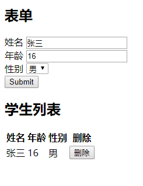

## 第03节：表单与表格

### 一、数据的双向绑定

**数据绑定**

上一章我们已经了解了如何将数据绑定到文本节点和属性节点。本节我们要实现数据的双向绑定，让data中的数据与文本框中的数据同步[demo01](https://github.com/xiaozhoulee/xiaozhou-examples/blob/master/05-Vue入门/第02章%EF%BC%9Avue的基本概念%EF%BC%88二%EF%BC%89/demo01.html)。
``` html
<body>
    <div id="app">
        <h1>数据绑定：{{message}}</h1>
        <input type="text" v-model="message">
    </div>
    <script src="../../script/vue.js"></script>
    <script>
        new Vue({
            el:"#app",
            data:{
                message:""
            }
        })
    </script>
</body>
```

可以通过v-model实现数据的双向绑定，当文本框中的数据发生变化的时候，v-model对应的值会跟着改变，在上面的程序中，我们将h1标签中的文本节点与message绑定，所以当文本框的内容改变，h1中的文本也会跟着改变。

**添加元素**

我们可以利用v-model来实现添加列表元素的功能[demo02](https://github.com/xiaozhoulee/xiaozhou-examples/blob/master/05-Vue入门/第02章%EF%BC%9Avue的基本概念%EF%BC%88二%EF%BC%89/demo02.html):
``` html
<body>
    <div id="app">
        <input v-model="newFruit" type="text">
        <button v-on:click="insert">添加</button>
        <ul>
            <li v-for="fruit in fruits">{{fruit}}</li>
        </ul>
    </div>
    <script src="../../script/vue.js"></script>
    <script>
        new Vue({
            el:"#app",
            data:{
                fruits:["香蕉","苹果","鸭梨"],
                newFruit:""
            },
            methods:{
                insert:function(){
                    this.fruits.push(this.newFruit);
                }
            }
        })
    </script>
</body>
```

下面做一个练习，结合上一章的内容，将添加元素和删除元素功能添加到一个文件中[demo03](https://github.com/xiaozhoulee/xiaozhou-examples/blob/master/05-Vue入门/第02章%EF%BC%9Avue的基本概念%EF%BC%88二%EF%BC%89/demo03.html)

``` html
<body>
	<div id="app">
		<input v-model="newFruit" type="text">
		<button v-on:click="insert">添加</button>
		<ul>
			<li v-for="(val,index) in fruits">
				{{val}}
				<span v-on:click="del(index)">删除</span>
			</li>
		</ul>
	</div>
	<script src="../../script/vue.js"></script>
	<script>
		new Vue({
			el:"#app",
			data:{
				fruits:["香蕉","苹果","鸭梨"]
			},
			methods:{
				del:function(index){
					this.fruits.splice(index,1);
				},
				insert:function(){
					this.fruits.push(this.newFruit);
				}	
			}
		})
	</script>
</body>
```

### 二、提交表单
在上个例子中，我们通过一个文本框和一个按钮实现了在列表中添加元素的功能，但是正常的开发工作中，我们不应该用这种方式提交数据，而是应该用提交表单的方式提交数据，下面我们在body中添加一个表单，并使用vue获取表单中的数据[demo04](https://github.com/xiaozhoulee/xiaozhou-examples/blob/master/05-Vue入门/第02章%EF%BC%9Avue的基本概念%EF%BC%88二%EF%BC%89/demo04.html)。
``` html
<!-- 变更的代码如下 -->
<form v-on:submit="insert">
    <input v-model="newFruit" type="text">
    <input type="submit" value="添加">
</form>
```

如上面的代码所示，我们不在使用按钮click事件来添加元素，而是使用表单的submit事件，其他的代码完全一样。运行程序后，发现新增的元素闪了一下就消失了，这是因为提交表单会重新加载页面，而我们的数据当页面刷新后就会消失，果所以如不阻止提交表单后页面重新加载，那么就需要阻止表单提交的默认行为。可以使用事件修饰符来实现这个功能[demo05](https://github.com/xiaozhoulee/xiaozhou-examples/blob/master/05-Vue入门/第02章%EF%BC%9Avue的基本概念%EF%BC%88二%EF%BC%89/demo05.html)。

``` html
<form v-on:submit.prevent="insert">
    <input v-model="newFruit" type="text">
    <input type="submit" value="添加">
</form>
```

在submit后面添加事件修饰符“.prevent”，可以阻止submit事件触发后重新加载页面。

### 三、事件修饰符详解
上一节我们已经初步了解了事件修饰符，本章我们进一步讲解常用的事件修饰符，常用的事件修饰符如下所示：

* .prevent
* .stop
* .once

上一节我们已经讲解了如何使用.prevent事件修饰符，本节我们通过两个例子讲解.stop和.once。

在JavaScript基础课程中，我们讲解了事件流的概念，事件有捕获和冒泡两个阶段，在默认情况下，事件在冒泡阶段被触发，如果希望阻止事件冒泡可以使用stopPropagation()，如果在vue中希望实现阻止事件冒泡的功能，可以使用事件修饰符[demo06](https://github.com/xiaozhoulee/xiaozhou-examples/blob/master/05-Vue入门/第02章%EF%BC%9Avue的基本概念%EF%BC%88二%EF%BC%89/demo06.html).

``` css
.big{
    width:200px;
    height:200px;
    background-color: yellow;
}

.small{
    width:100px;
    height:100px;
    background-color: red;
}
```

``` html
<body>
    <div id="app">
        <div v-on:click="bigEvent" class="big">
            <!-- 去掉.stop，事件会冒泡，添加.stop可以阻止事件冒泡 -->
            <div v-on:click.stop="smallEvent" class="small"></div>
        </div>
    </div>
    <script src="../../script/vue.js"></script>
    <script>
        new Vue({
            el:"#app",
            methods:{
                bigEvent:function(){
                    console.log("点击big div");
                },
                smallEvent:function(){
                    console.log("点击small div");
                }
            }
        })
    </script>
</body>
```

在学习jQuery的时候，我们可以通过one来绑定事件，当事件触发一次后将不再触发，在vue中我们可以使用事件修饰符.once实现相同的功能[demo07](https://github.com/xiaozhoulee/xiaozhou-examples/blob/master/05-Vue入门/第02章%EF%BC%9Avue的基本概念%EF%BC%88二%EF%BC%89/demo07.html)

``` html
<body>
    <div id="app">
        <!-- 因为添加了.once，所以事件被触发一次后，将不会再次触发 -->
        <button v-on:click.once="myEvent">按钮</button>
    </div>
    <script src="../../script/vue.js"></script>
    <script>
        new Vue({
            el:"#app",
            methods:{
                myEvent:function(){
                    alert("只能弹出一次");
                }
            }
        })
    </script>
</body>
```


### 四、在表格中添加和删除数据
下面我们来做一个练习，功能如下[demo08.html](https://github.com/xiaozhoulee/xiaozhou-examples/blob/master/05-Vue%E5%85%A5%E9%97%A8/%E7%AC%AC03%E7%AB%A0%EF%BC%9A%E8%B4%AD%E7%89%A9%E8%BD%A6/demo08.html)：

* 页面分成两部分，左侧是一个表单，右侧是一个表格
* 当提交表单的时候可以将数据添加到表格中
* 表格的最后一列是删除按钮，点击可以删除当前行。

 

### 接下来我们来实现一个购物车案例

### 一、功能展示
* 页面左侧为商品列表
    * 商品有名称和单价
    * 可以设置购买数量
    * 可以添加到购物车
* 页面右边为购物车
    * 可以修改商品数量
    * 可以删除商品
    * 点击购买，弹出总价

### 二、需求分析
根据功能要求，我们使用vue来构建购物车功能，具体思路如下：
1. 确定商品列表的数据格式
``` json
[
    {
        name:"香蕉",
        price:10.5,
        count:0
    },
    {
        name:"苹果",
        price:5.7,
        count:0
    },
    {
        name:"鸭梨",
        price:2.1,
        count:0
    }
]
```
2. 购物车的数据格式与商品列表相同，但开始是一个空数组。
3. 确定商品列表表格的字段
    * 商品名称
    * 商品单价
    * 数量（可增减）
    * 添加购物车（将指定数量的商品添加到购物车中）
4. 确定购物车表格的字段
    * 商品名称
    * 单价
    * 数量（可增减）
5. 购物车需要一个结算按钮计算商品的总价。


### 三、功能实现
数据格式与功能确定之后，需要编写商品列表的页面（为了界面美观，此案例使用bootstrap样式，[demo01.html](https://github.com/xiaozhoulee/xiaozhou-examples/blob/master/05-Vue%E5%85%A5%E9%97%A8/%E7%AC%AC03%E7%AB%A0%EF%BC%9A%E8%B4%AD%E7%89%A9%E8%BD%A6/demo01.html)）。
``` html
<table class="table table-bordered">
    <thead>
        <th>商品名称</th>
        <th>商品单价</th>
        <th>商品数量</th>
        <th>添加至购物车</th>
    </thead>
    <tbody>
        <tr v-for="(val,index) in goodsList">
            <td>{{val.name}}</td>
            <td>{{val.price}}</td>
            <td>
                <button>-</button>
                <span>{{val.count}}</span>
                <button>+</button>
            </td>
            <td>
                <button class="btn btn-primary">添加购物车</button>
            </td>
        </tr>
    </tbody>
</table>
```

商品数量是一个计数器功能，点击【-】数量减1，但是不能小于零，点击【+】数量加1。我们需要为这两个按钮绑定事件，并编写对应的功能[demo02.html](https://github.com/xiaozhoulee/xiaozhou-examples/blob/master/05-Vue%E5%85%A5%E9%97%A8/%E7%AC%AC03%E7%AB%A0%EF%BC%9A%E8%B4%AD%E7%89%A9%E8%BD%A6/demo02.html)
``` html
<td>
    <button v-on:click="sub(index)">-</button>
    <span>{{val.count}}</span>
    <button v-on:click="add(index)">+</button>
</td>
```

``` js
methods:{
    add:function(i){
        this.goodsList[i].count++;
    },
    sub:function(i){
        if(this.goodsList[i].count>0){
            this.goodsList[i].count--;
        }
    }
}
```

当用户点击【添加购物车】按钮可以将该行的数据添加到右侧的购物车表格当中[demo03](https://github.com/xiaozhoulee/xiaozhou-examples/blob/master/05-Vue%E5%85%A5%E9%97%A8/%E7%AC%AC03%E7%AB%A0%EF%BC%9A%E8%B4%AD%E7%89%A9%E8%BD%A6/demo03.html)。

``` html
<!-- 商品列表 -->
<td>
    <button v-on:click="insert(index)" class="btn btn-primary">添加购物车</button>
</td>
```

``` html
<!-- 购物车 -->
<table class="table table-bordered">
    <thead>
        <th>商品名称</th>
        <th>商品单价</th>
        <th>商品数量</th>
        <th>删除</th>
    </thead>
    <tbody>
        <tr v-for="(val,index) in shoppingCart">
            <td>{{val.name}}</td>
            <td>{{val.price}}</td>
            <td>
                <button v-on:click="cartSub(index)">-</button>
                <span>{{val.count}}</span>
                <button v-on:click="cartAdd(index)">+</button>
            </td>
            <td>
                <button class="btn btn-primary">删除</button>
            </td>
        </tr>
    </tbody>
</table>
```

``` js
cartSub:function(i){
    this.shoppingCart[i].count++;
},
cartAdd:function(i){
    if(this.shoppingCart[i].count>1){ //购物车数量了不能为0
        this.shoppingCart[i].count--;
    }
},
insert:function(i){
    this.shoppingCart.push(this.goodsList[i]);
}
```

目前为止，我们已经实现了商品列表的计数器功能和添加购物车功能，但是现在的程序有两个问题：

* 变更数量的时候，商品列表和购物车的商品会同时变。
* 点击【添加至购物车】按钮，不应该重复添加同一个商品，而是应该添加数量。

第一个问题是因为，我们添加的对象是引用类型，购物车数组里的对象与商品列表中的对象指向的是一个对象，所以一个数量变化，另一个也会变化（在“JavaScript进阶”课程中有详细的讲解），所以我们需要克隆一个商品对象，再加入到购物车中[demo04.html](https://github.com/xiaozhoulee/xiaozhou-examples/blob/master/05-Vue%E5%85%A5%E9%97%A8/%E7%AC%AC03%E7%AB%A0%EF%BC%9A%E8%B4%AD%E7%89%A9%E8%BD%A6/demo04.html)。

``` js
clone:function(obj){
    var newobj = {};
    for(var i in obj){
        newobj[i] = obj[i]
    }
    return newobj;
},
insert:function(i){
    var newgoods = this.clone(this.goodsList[i])
    this.shoppingCart.push(newgoods);
}
```

这里我们编写了一个clone方法实现了对象的浅克隆。并将克隆的对象添加到购物车，这样购物车中的数量变更就不会影响商品列表中的数量了。

然后我们再来处理商品重复的问题，我们需要判断购物车是否由再次添加的商品，如果没有，那么将商品添加至购物车，如果购物车已经有这个商品了，那么应该增加指定商品的数量[demo05.html](https://github.com/xiaozhoulee/xiaozhou-examples/blob/master/05-Vue%E5%85%A5%E9%97%A8/%E7%AC%AC03%E7%AB%A0%EF%BC%9A%E8%B4%AD%E7%89%A9%E8%BD%A6/demo05.html)。

``` js
insert:function(index){
    if(this.goodsList[index].count === 0){
        alert("请选择数量！");
        return;
    }
    for(var i = 0;i<this.shoppingCart.length;i++){
        if(this.goodsList[index].name === this.shoppingCart[i].name){
            this.shoppingCart[i].count += this.goodsList[index].count;
            return;
        }
    }
    var newgoods = this.clone(this.goodsList[index])
    this.shoppingCart.push(newgoods);
}
```

我们在insert方法中添加了一些判断条件，让购物车的功能更加完善

* 首先，商品数量为0不能添加到购物车。
* 然后，当添加购物车时，若购物车已经有了这个商品，那么值增加数量，不增加种类。
* 最后，若购物车没有这个商品，那么在购物车中正常添加商品。

现在，将商品添加到购物车的功能我们已经完成了，接下来要做的是在购物车中删除商品。这个和之前我们做的任务列表的例子很像[demo06.html](https://github.com/xiaozhoulee/xiaozhou-examples/blob/master/05-Vue%E5%85%A5%E9%97%A8/%E7%AC%AC03%E7%AB%A0%EF%BC%9A%E8%B4%AD%E7%89%A9%E8%BD%A6/demo06.html)。

``` html
<td>
    <button v-on:click="del(index)" class="btn btn-primary">删除</button>
</td>
```

``` js
del:function(i){
    this.shoppingCart.splice(i,1);
}
```

最后我们要实现点击【结算】按钮，计算出总价[demo07.html](https://github.com/xiaozhoulee/xiaozhou-examples/blob/master/05-Vue%E5%85%A5%E9%97%A8/%E7%AC%AC03%E7%AB%A0%EF%BC%9A%E8%B4%AD%E7%89%A9%E8%BD%A6/demo07.html)。

``` html
<button v-on:click="count" class="btn btn-success">结账</button>
```

``` js
count:function(){
    var allPrice = 0;  //所有商品的总价
    this.shoppingCart.map(function(val,index){
        var totalPrice = val.price * val.count; //计算单个商品总价；
        console.log(totalPrice);
        allPrice += totalPrice;
    })
    alert(`您总计消费了${allPrice}元`)
}
```

通过count方法，我们可以计算购物车中所有商品的总价，并通过提示框输出，到此购物车的所有需求我们已经完成。