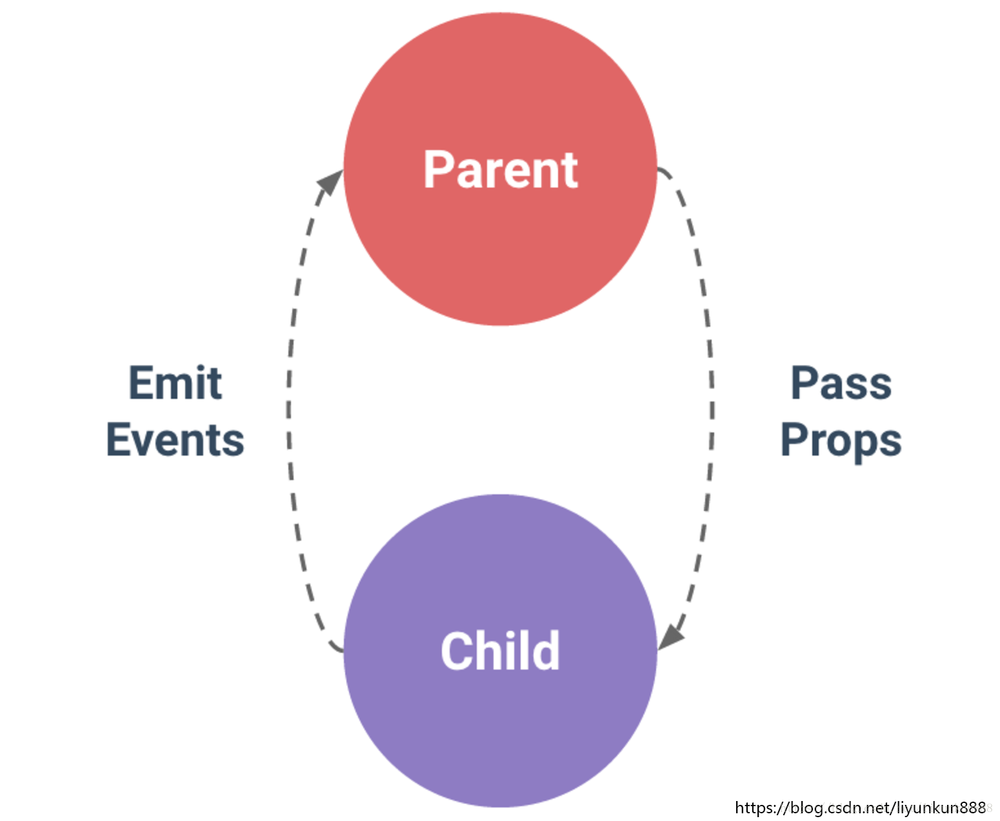

# 第03节：组件传值

### 前言

vue的组件传值分为三种方式：父传子、子传父、非父子组件传值
引用官网的一句话：父子组件的关系可以总结为 prop 向下传递，事件向上传递
父组件通过 prop 给子组件下发数据，子组件通过事件给父组件发送消息，如下图所示：


### 一、父级向子级传值 
子组件的代码：
``` html

```

### 二、子级向父级传值

### 三、同级组件传值

### 四、vuex概述
