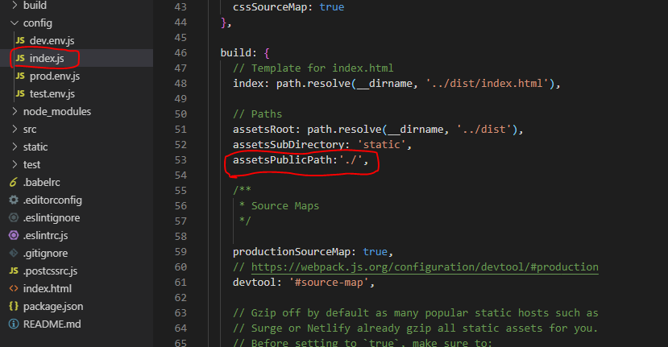

# 第06节：发布vue项目

### 一、打包并发布
1、首先第一肯定是要有Node.js及npm这个不多说了  
2、在项目的根目录下运行命令行输入npm run build 给项目打包
3、使用npm run build进行打包，这个时候你直接打开dist/下的index.html,会发现文件可以打开，但是所有的js，css，img等路径有问题是指向根目录的（打开了但是没有内容），此时需要修改config/index.js里的assetsPublicPath的字段，初始项目是/他是指向项目根目录的，这时改为 ./ 就可以正常运行了

### 二、项目配置

github pages
1、首页创建一个仓库，此处直接忽略