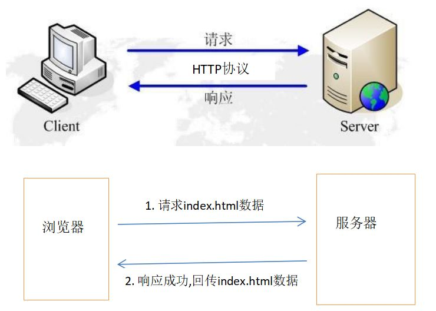

# 第01节：HTTP协议概述

### 一、什么是http协议

在讨论什么是http协议之前，先来看看什么是**协议**

我们先来看一个生活中的例子：

A购买了B的一台电脑，A和B签署了一份协议，协议的内容是

> 如果A使用电脑的过程中，电脑出现问题，那么B应该负责电脑的维修事宜。

协议签署完成之后，那么以后只要A的电脑出现问题，B就一定会去维修（我们假设A和B都遵守协议）。

通过上面的例子我们知道了，**协议就是一个约定（契约），有了这个约定，B就会根据A的行为（电脑出现问题）做出相应的反应（维修电脑）。**

我们再来看http协议，http协议是客户端（A）与服务器端（B）之间的约定。这个约定规定了：**只要客户端向服务器发送一条消息（请求），服务器就会给予一条回复（响应）。**

### 三、http协议的实际应用

通过上面的例子，大家应该对http协议有了初步的了解，然后我们再来结合web应用（或网站）来说说http协议。

我们结合上面的图片，说说访问一个网站要经历哪些步骤。

1. 首先打开浏览器（客户端、Client）
2. 在浏览器的地址栏输入网址，例如百度的网址。
3. 按下回车键，这个时候我们的浏览器就会向服务器发送一条请求，这条请求告诉服务器：“我要访问百度首页。”
4. 服务器接收到这条请求后，程序会将百度首页的代码（html，css，js）传递给我们的浏览器。
5. 最后，浏览器将这些代码编程可以浏览的网页展示给我们。

这样我们成功地完成了一次百度首页的访问，那为什么客户端发送请求，浏览器就会响应呢，因为他们都遵循http协议。

### 四、总结

本节我们已经初步了解了什么是http协议，关于http协议的更多问题，我们会在后续章节不断渗透给大家。
