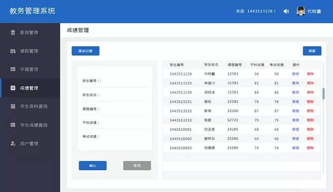

# 第02节：异步交互数据

### 一、Ajax的基本概念

上一节我们已经介绍了http协议，大家有没有发现，案例中我们访问的百度首页的时候，服务器会将整个首页的代码都发给浏览器。也就是说，我们每次向服务器发送请求的时候，都是整个网页刷新，这对于很多场景来说并不适用。



例如上面的截图，在一个教务管理系统中查询学生的信息，整个页面当中只有表格中的数据是变化的，其他内容并没有变化。这样的话我们每次向服务器发送请求都刷新整个页面就会显得有些浪费资源。这时，Ajax就可以发挥作用了。

通过Ajax，我们可以在不刷新整个页面的情况下向服务器发送请求，并获取数据，这样就能实现网页内容的局部刷新，从而减少了数据交互量，提升了软件执行效率。

### 二、jQuery中的ajax方法

Ajax是通过浏览器中的XMLHttpRequest对象实现的，关于这部分内容我们下节会讨论如何使用这个对象，本节我们先使用jQuery实现一个最基本的Ajax功能。

目标是在网页中显示一个按钮，当点击这个按钮的时候，用alert弹出服务器的文本数据，下面我们来实现这个功能。

#### 创建静态服务器

在第六章我们学过http-server了，这里我们还是用它创建一个静态服务器。

``` bash
# 如果没有安装http-server，可以先全局安装
npm install -g http-server
# 在当前目录下启动服务器（例如命令行在D盘的server文件夹下执行，那么D:/server就会变成静态文件服务器目录）
http-server
```

我们在服务器中创建一个data目录用于存放数据，data中添加一个hello.txt的文本文件。然后再server目录下创建一个index.html，并且在项目中添加jQuery，目录结构如下所示：


#### 编码

文件准备就绪之后，先在hello.txt中添加一行文字作为数据，

``` txt
Hello Ajax
```

#### 使用http-server在data文件夹启动一个服务器

``` node.js
http-server
```

#### 使用Ajax获取数据
``` html
<script>
        $("button").click(function(){//点击执行函数
            //输出data.txt中的数据，hello ajax
            $.ajax({
                type:"get",//请求方法
                url:"/hello.txt"//请求路径
            }).done(function(res){
                alert(res)
            })

        })
</script>
```


### 三、同步与异步概述

我们在回到Ajax的概念上，Ajax（Asynchronous Javascript And XML）的全称是“异步 JavaScript 和 XML”，这个名字有写历史遗留问题，大家只要知道“异步”这个词就可以了。

相对于【异步】和【同步】这两个概念，我们之前写的大部分代码都是同步的程序，不管程序是分支语句还是循环语句，都是由上至下的执行（可以理解为在一条直线上执行），如果有行代码出错，整个程序就会被阻塞，后续代码不会继续执行。

【异步】的概念可以理解为程序再两条或多条线上执行，例如第二章中的计时器方法就是一个典型的异步程序。我们回顾一下计时器方法，体验一下异步程序的特点。

``` html
    <script>
        let a = 10;//新建变量a等于10
        let b = 20;//新建变量b等于20
        console.log(a+b);//输出a加b（这是一条异步线）
        
        setTimeout(function(){
            a=a+10;
            console.log(a+b);//输出a加b（这是另一条异步线）
        },1000);
        
        //得出两个值30和40
    </script>

```

### 四、进一步了解异步的程序

``` html
<script>
// 异步的程序不能通过return返回想要的值
        let a = 10;//新建变量a等于10
        let b = 20;//新建变量b等于20
        console.log(a+b);//输出a加b（这是一条异步线）
        
        setTimeout(function d (){
            a=a+10;
            // console.log(a+b);//输出a加b（这是另一条异步线）
            return true;
        },1000);
        setTimeout(function(){
            if(this.d==true){
                console.log('return返回的值')
            }else{
                console.log('非return返回的值')
            };
            if(a==20){
                console.log('return返回的值')
            }else{
                console.log('非return返回的值')
            };
        },2000);
    </script>
```
### 五、总结

我们已经知道什么是异步交互数据以及异步的特性下一节我们将不使用任何库或者框架异步获取数据