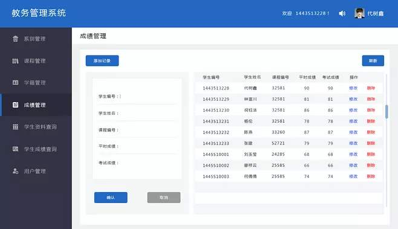

# 第04节：Promise对象

### 一、Promise对象概述

#### 说明

Promise对象是ES2015添加的新特性

简单来说就是一个对象,用来传递异步操作的消息,是解决异步编程的一种方 案,promise原理说起来并不难,他的内部有三个状态,分别是pending , fulfilled 和 rejected . pending是对象创建后的初始状态，当对象fulfill（成功）时变为fulfilled， 当对象reject（失败）时变为rejected。且只能从pengding变为fulfilled或rejected ， 而不能逆向或从fulfilled变为rejected 、从rejected变为fulfilled,

 
#### Promise的优劣
有了Promise对象，就可以将异步操作以同步操作的流程表达出来，避免了层层嵌套的回调函数。此外，Promise对象提供统一的接口，使得控制异步操作更加容易。 
Promise也有一些缺点。首先，无法取消Promise，一旦新建它就会立即执行，无法中途取消。其次，如果不设置回调函数，Promise内部抛出的错误，不会反应到外部。第三，当处于Pending状态时，无法得知目前进展到哪一个阶段（刚刚开始还是即将完成）。
### 二、使用Pormise对象封装一个Ajax方法