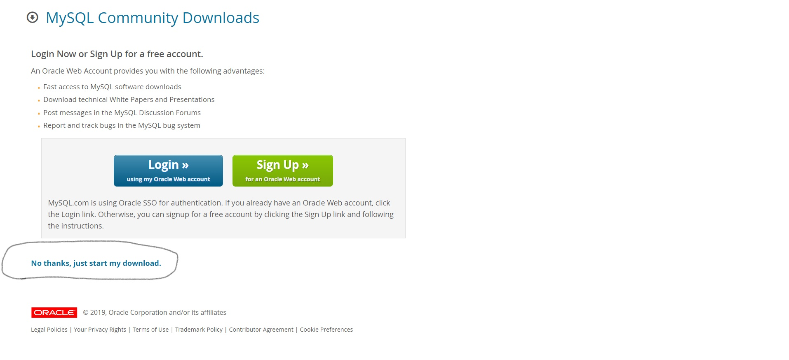
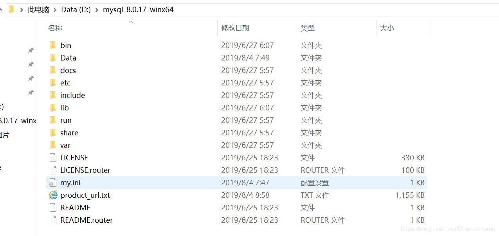
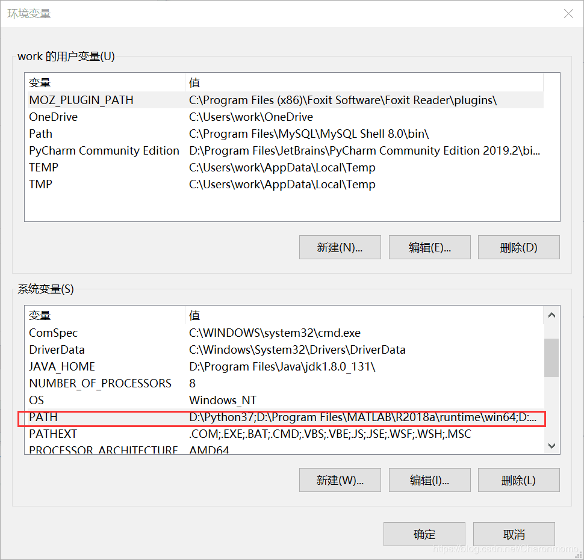
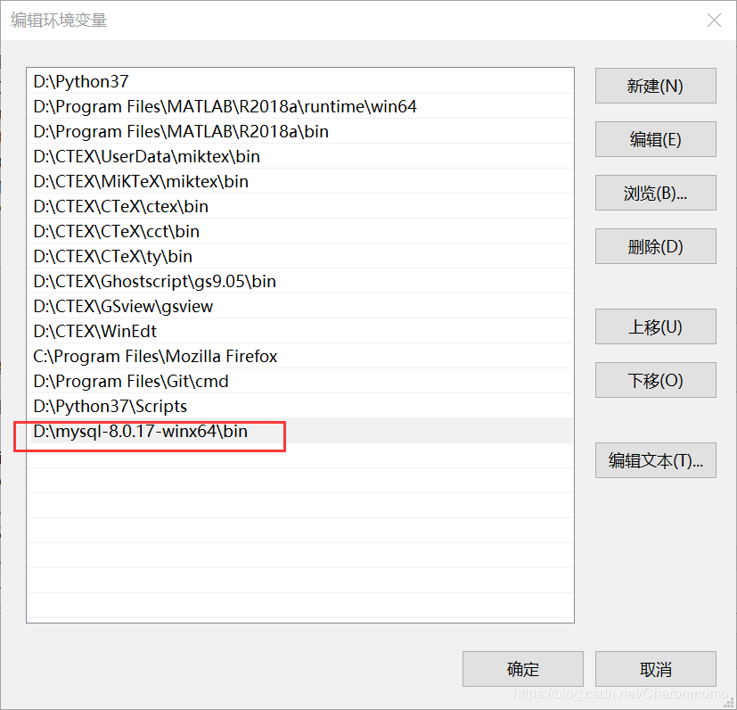
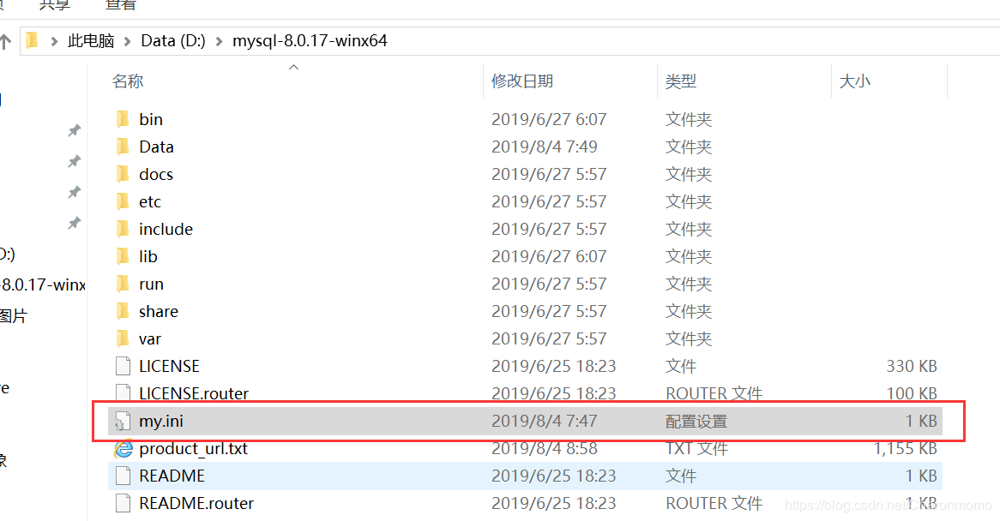
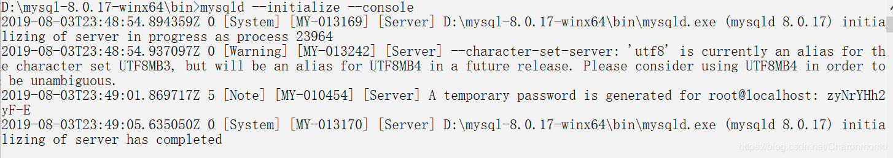
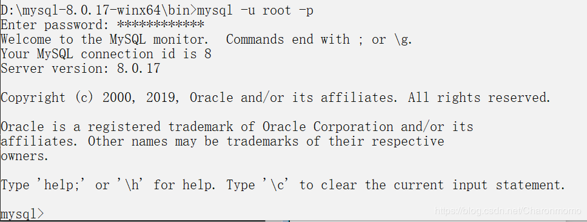
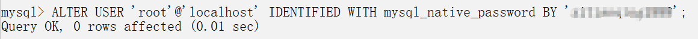

# 第01节:安装MySQL
### 一、下载MySQL8.0.17安装包
* 下载254.2M的
* 注意：在配置my.ini文件时，要修改里面的  mysql的安装目录和mysql数据库的数据的存放目录  需要改成自己所安装的目录
→[安装包在这里](https://dev.mysql.com/downloads/file/?id=487686)

### 二、解压安装包到目录
* 把安装包解压到出来，解压出来后打开文件夹，会有以下的文件，自动生成的，其中data文件还有my文件是后续添加的，下面会有方法

### 三、配置环境变量
* 用右键点击我的电脑→属性→高级系统设置→环境变量
* 你点击红色区域,也就是在系统变量里找到PATH，然后双击进去

* 点击“编辑”，添加MySQL的bin文件夹的地址

### 四、4.配置文件
* 在MySQL文件夹D:\mysql-8.0.17-winx64中新建一个my.ini文件，写入如下信息：
```h
[mysqld]
# 设置3306端口
port=3306
# 设置mysql的安装目录
basedir=D:\\mysql-8.0.17-winx64 # 切记此处一定要用双斜杠\\，单斜杠我这里会出错，不过看别人的教程，有的是单斜杠。自己尝试吧
# 设置mysql数据库的数据的存放目录
datadir=D:\\mysql-8.0.17-winx64\\Data # 此处同上
# 允许最大连接数
max_connections=200
# 允许连接失败的次数。这是为了防止有人从该主机试图攻击数据库系统
max_connect_errors=10
# 服务端使用的字符集默认为UTF8
character-set-server=utf8
# 创建新表时将使用的默认存储引擎
default-storage-engine=INNODB
# 默认使用“mysql_native_password”插件认证
default_authentication_plugin=mysql_native_password
[mysql]
# 设置mysql客户端默认字符集
default-character-set=utf8
[client]
# 设置mysql客户端连接服务端时默认使用的端口
port=3306
default-character-set=utf8

```
### 五、安装MySQL
以管理员的身份打开cmd，转到MySQL安装路径，输入如下命令初始化数据库：
```sql
mysqld --initialize --console
```

注意！执行输出结果里面有一段：

[Note] [MY-010454] [Server] A temporary password is generated for root@localhost: zyNrYHh2yF-E

其中root@localhost:后面的“zyNrYHh2yF-E”就是初始密码（不含首位空格）。在没有更改密码前，需要记住这个密码，后续登录需要用到。

要是关快了，或者没记住，那也没事，删掉初始化的 datadir 目录，再执行一遍初始化命令，又会重新生成的。当然，也可以使用安全工具，强制改密码，用什么方法，自己随意。
### 六、安装服务
在MySQL的安装目录D:\mysql-8.0.17-winx64\bin中输入
```sql
mysqld --install
```
安装成功会有如下代码
```sql
D:\mysql-8.0.17-winx64\bin>mysqld --install
Service successfully installed
```
原命令应为：
```sql
mysqld --install [服务名]
```
但后面的服务名可以不写，默认的名字为 mysql。当然，如果你的电脑上需要安装多个MySQL服务，就可以用不同的名字区分了，比如 mysql5 和 mysql8。
### 七、启动MySQL服务
* 启动MySQL：
```sql
net start mysql
```
【通过命令net stop mysql停止服务。通过命令sc delete MySQL/mysqld -remove卸载 MySQL 服务】
### 八、更改密码
用管理员身份打开cmd然后输入
```sql
mysql -u root -p
```
* 输入之前 的密码就可以进入MySQL了。

* 在MySQL中执行命令：
```sql
ALTER USER 'root'@'localhost' IDENTIFIED WITH mysql_native_password BY '新密码';
```
* 修改密码，注意命令尾的；一定要有，这是mysql的语法



安装成功