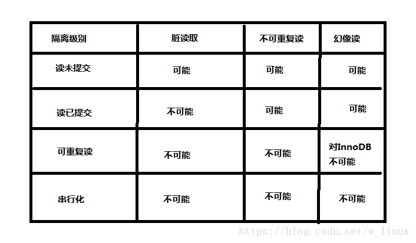

# 第 03 节:常用的 SQL 语句

### 一、SQL 分类

- DDL:数据定义语言，可以用来曹组数据库对象：库，表，列等
- DML:数据操作语言，增删改数据
- DCL:数据控制语言，用来设置访问权限和安全级别
- DQL:数据查询语言，用来查询数据库中的数据

### 二、数据类型

- int:最大值
- double:内部浮点计算的类型
- char:固定长度
- varchar:可变长度
- text:大文本内容，博客存储文章
- blob:是一个二进制大型对象，是一个可以存储大量数据的容器，它能容纳不同大小的数据。
- date:日期
- time:时间
- titmestamp:时间戳
- datatime:日期和时间的组合

### 三、常用操作命令

- 显示所有数据库：

```sql
show databases;
```

- 查看数据库详细信息：

```sql
show create database 数据库库名;
show create database db_name;
```

- 创建数据库：

```sql
 create database 数据库库名
 create database a
 ///
 create database if not exists 数据库库名 default charset utf8 collate utf8_general_ci
 create database if not exists b default charset utf8 collate utf8_general_ci;//用反引号
```

- 将数据库修改为 UTF8：

```sql
alter database 数据库库名 character set utf8;
alter database db_name character set utf8;
```

- 切换数据库：

```sql
use 数据库库名；
use database_name;
```

- 删除数据库：

```sql
drop database 数据库库名；
drop database db_name;
```

- 创建表：

```sql
create table 表名(字段名称 int(6),字段名称 varchar(20)......);
create table student(id int(6),name varchar(20));
```

- 显示数据库所有表:
```sql
show tables;
```

- 增加字段:
```sql
alter table 表名 add 字段名 字段类型
alter table book add count int;
```

- 修改字段:
```sql
alter table 表明名 modify 字段名称 字符类型
alter table book modifu price int;
```

- 删除字段:
```sql
alter table 表名 drop 字段名
alter table book drop count;
```

- 向表中插入数据
```sql
insert into 表名(想插入的字段名称,...) values(想插入的字段的值)
insert into 表明 values(表中所有字段的值)
```

* 删除指定的某一行
```sql
delete from 表名 where 条件表达式;
delete from student where id=1;
```

* 修改表中记录
```sql
update 表名 set 字段名=新的字段值 where 条件表达式
update student set name=小李 where id=1;
```

- 删除表：
```sql
drop table 表名;
drop table table_name;
```

- 查看表结构：
```sql
desc 表名
desc table_name;
```
* 清空表
```sql
delete from 表名;
delete from student;
```
以上是一些常用的 SQL 语句和函数的示例代码：
具体的 MySQL 语句与函数在右方示例代码内
→
[示例代码](https://github.com/xiaozhoulee/xiaozhou-examples/blob/master/09-MySQL/%E7%A4%BA%E4%BE%8B%E5%91%BD%E4%BB%A4.md)

### 四、存储引擎

```sql
show engines; --显示所有存储引擎
--创建表的时候可以指定存储引擎，如果不指定就会使用默认的存储引擎
show create table user; --查看user表当前使用的存储引擎。
--不同存储引擎的特性不同
```

- MyISAM:节省存储空间，查询较多。
- InnoDB:支持事务，修改较多。
- MEMORY:数据存储在内存中，可以存储非永久保存的数据

### 五、事务 transaction

- 事务可以保证多个任务的原子性，例如三个任务如果有一个没有完成，那么三个都不执行。
- 可以保证多个操作要么全部成功，要么全部失败。

事务的特征

- 原子性(A)：事务是最小单位，不可再分
- 一致性(C)：事务要求所有的 DML 语句操作的时候，必须保证同时成功或者同时失败
- 隔离性(I)：事务 A 和事务 B 之间具有隔离性
- 持久性(D)：是事务的保证，事务终结的标志(内存的数据持久到硬盘文件中)

```sql
开启事务：Start Transaction
事务结束：End Transaction
提交事务：Commit Transaction
回滚事务：Rollback Transaction
```

事务的隔离级别

- 读未提交：read uncommitted
- 读已提交：read committed
- 可重复读：repeatable read
- 串行化：serializable
  

### 六、索引

提升数据库查询效率，表中每一个字段都可以添加索引，主键会自动添加索引，所以按照主键查询效率更高。

什么情况下添加索引

- 该字段数据量庞大
- 该字段很少的 DML 操作
- 该字段经常出现在 where 条件中

```sql
--创建索引
--create index 索引名 on 表名(列名);
create index name_index on user(name);
--查看索引
show index from user;
--删除索引
drop index name_index on user;
```

### 七、视图

视图就是一个查询结果，可以隐藏表中的细节。

```sql
--创建视图
--create view 视图名称 as 查询语句;
create view user_view as select name,age,sex from user;
--查询视图
select * from user_view;
--修改视图
alter view user_view as select name,age from user;
--删除视图
drop view user_view if exists user_view;
```
