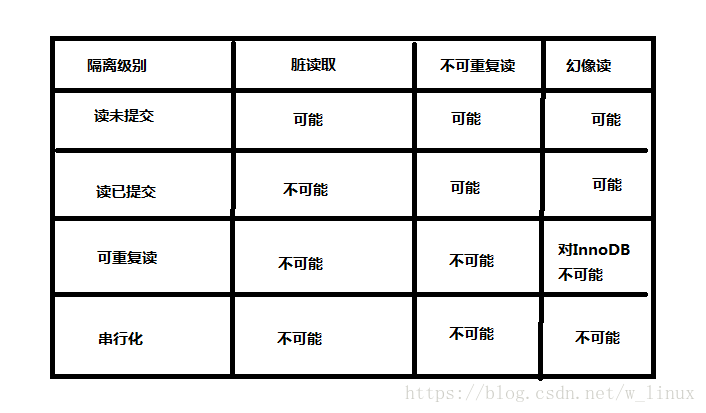

# 第九章第三节常用的 SQL 语句

### SQL 分类

- DDL:数据定义语言，可以用来曹组数据库对象：库，表，列等
- DML:数据操作语言，增删改数据
- DCL:数据控制语言，用来设置访问权限和安全级别
- DQL:数据查询语言，用来查询数据库中的数据

### 数据类型

- int:最大值
- double:内部浮点计算的类型
- char:固定长度
- varchar:可变长度
- text:大文本内容，博客存储文章
- blob:是一个二进制大型对象，是一个可以存储大量数据的容器，它能容纳不同大小的数据。
- date:日期
- time:时间
- titmestamp:时间戳
- datatime:日期和时间的组合

### 二、常用操作

- 显示所有数据库：show databases;
- 查看数据库详细信息：show create database db_name;
- 创建数据库：CREATE DATABASE `db_name` DEFAULT CHARACTER SET utf8 COLLATE utf8_general_ci; //用反引号
- 将数据库修改为 UTF8：alter database db_name character set utf8;
- 切换数据库：use database_name;
- 删除数据库：drop database db_name;
- 创建表：create table 表名(字段名称 字段类型,字段名称 字段类型......);
- 显示数据库所有表:show tables;
- 删除表：drop table table_name;
- 查看表结构：desc table_name;

[示例代码](https://github.com/xiaozhoulee/xiaozhou-examples/blob/master/09-MySQL/%E7%A4%BA%E4%BE%8B%E5%91%BD%E4%BB%A4.md)

### 三、存储引擎

```sql
show engines; --显示所有存储引擎
--创建表的时候可以指定存储引擎，如果不指定就会使用默认的存储引擎
show create table user; --查看user表当前使用的存储引擎。
--不同存储引擎的特性不同
```

- MyISAM:节省存储空间，查询较多。
- InnoDB:支持事务，修改较多。
- MEMORY:数据存储在内存中，可以存储非永久保存的数据

### 四、事务 transaction

- 事务可以保证多个任务的原子性，例如三个任务如果有一个没有完成，那么三个都不执行。
- 可以保证多个操作要么全部成功，要么全部失败。

事务的特征

- 原子性(A)：事务是最小单位，不可再分
- 一致性(C)：事务要求所有的 DML 语句操作的时候，必须保证同时成功或者同时失败
- 隔离性(I)：事务 A 和事务 B 之间具有隔离性
- 持久性(D)：是事务的保证，事务终结的标志(内存的数据持久到硬盘文件中)

```sql
开启事务：Start Transaction
事务结束：End Transaction
提交事务：Commit Transaction
回滚事务：Rollback Transaction
```

事务的隔离级别

- 读未提交：read uncommitted
- 读已提交：read committed
- 可重复读：repeatable read
- 串行化：serializable

### 五、索引

提升数据库查询效率，表中每一个字段都可以添加索引，主键会自动添加索引，所以按照主键查询效率更高。

什么情况下添加索引

- 该字段数据量庞大
- 该字段很少的 DML 操作
- 该字段经常出现在 where 条件中

```sql
--创建索引
--create index 索引名 on 表名(列名);
create index name_index on user(name);
--查看索引
show index from user;
--删除索引
drop index name_index on user;
```

### 六、视图

视图就是一个查询结果，可以隐藏表中的细节。

```sql
--创建视图
--create view 视图名称 as 查询语句;
create view user_view as select name,age,sex from user;
--查询视图
select * from user_view;
--修改视图
alter view user_view as select name,age from user;
--删除视图
drop view user_view if exists user_view;
```
