# 第九章第二节

### 安装MySQL
####一、下载MySQL安装包
首先数据库的官网http://www.mysql.com下载MySQL。
点击后进入如下页面
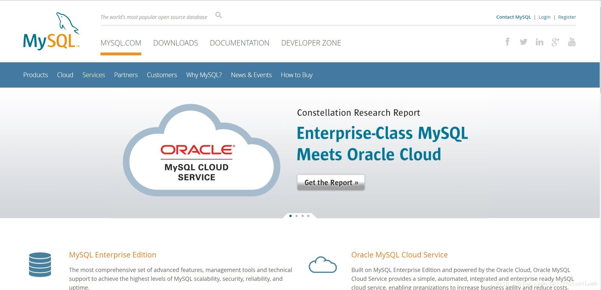
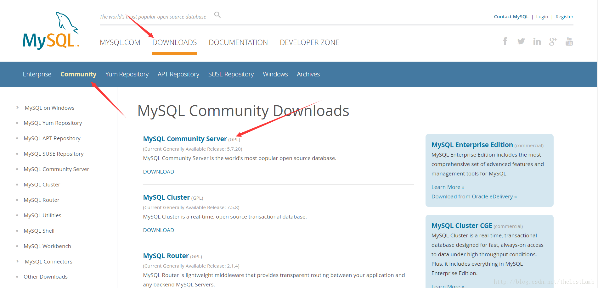

滑到下面，找到Recommended Download，然后点击go to download page。如下图： 
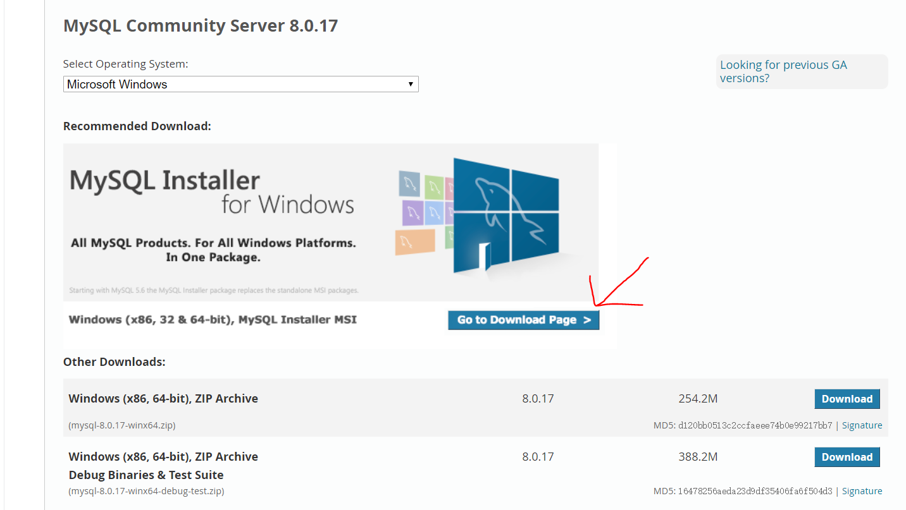
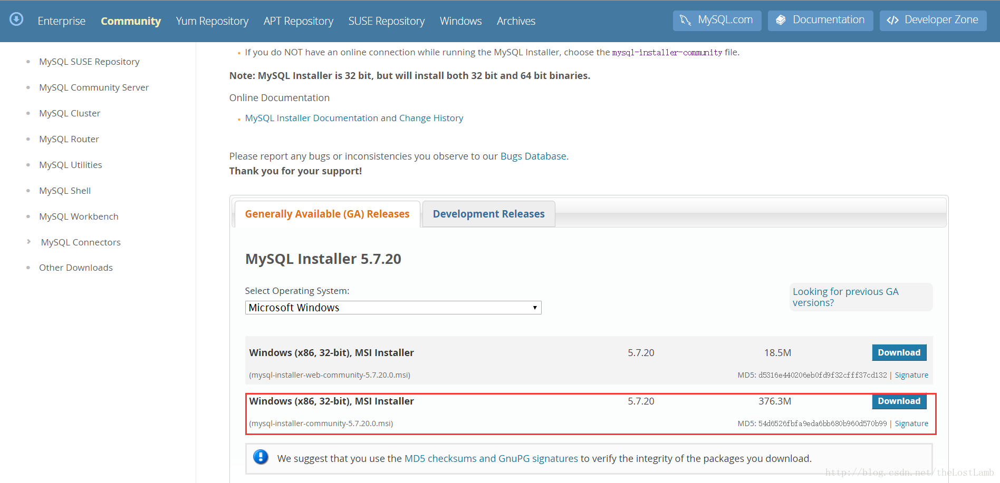

点击download进入下载页面选择No thanks, just start my download就可以开始下载了，当然你要是想注册也可以注册一下。
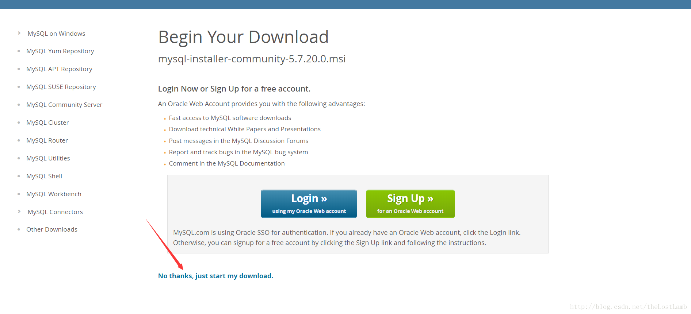

####二、安装MySQL
2.选择 I accept 然后点击next进入下一步。
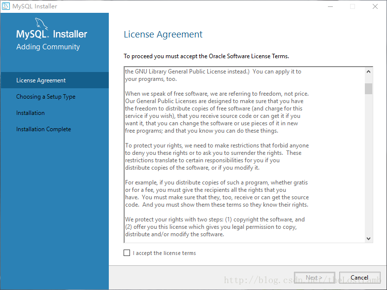

3.这里选择Developer Default，然后点击next进入下一步。
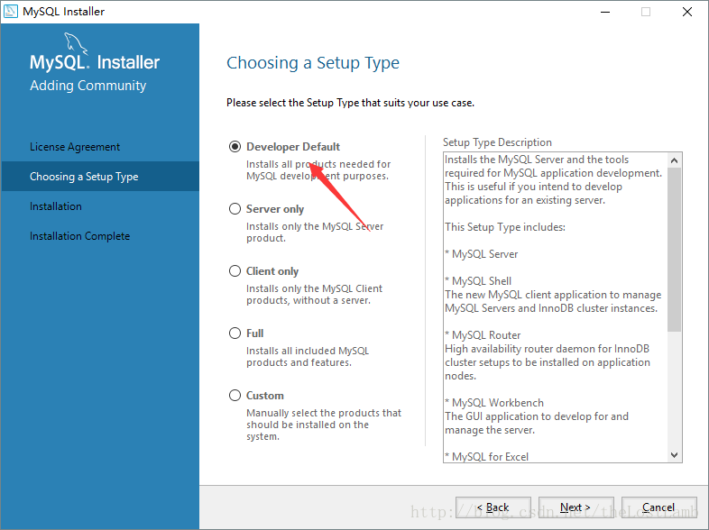

4.这一步是检查安装条件，直接点击next进入下一步就可以了。
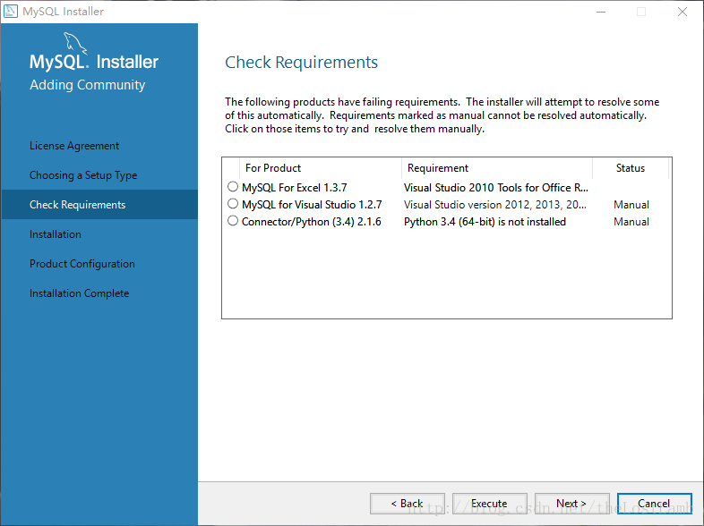

5.这里直接点击execute执行就可以了，执行完后点击next进入下一步。
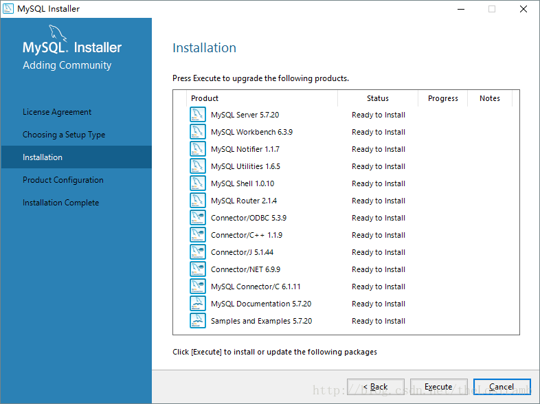

6.继续点击next进入下一步。


7.选择第一个然后点击next进入下一步。
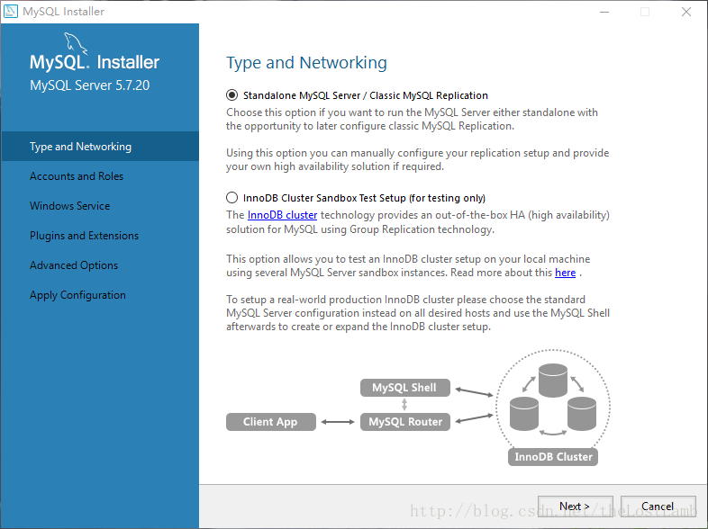

8.这里直接点击next进入下一步就可以了。
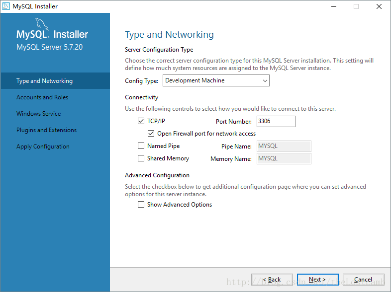

9.设置root密码然后点击next进入下一步。
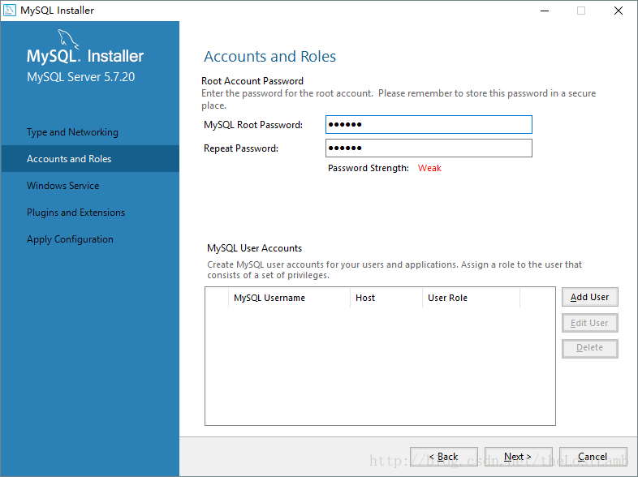

10.点击next进入下一步。
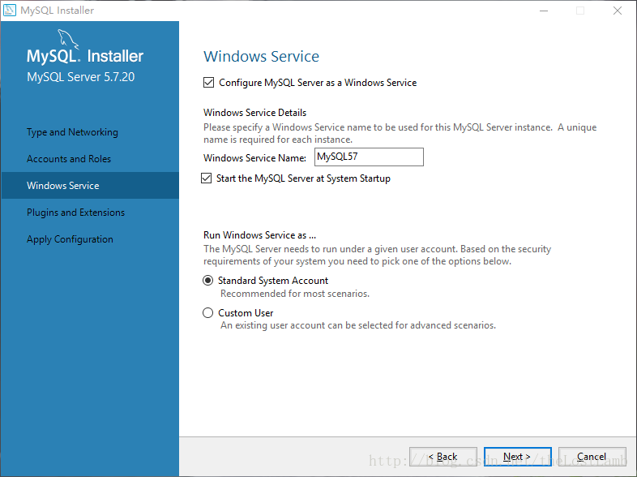

11.继续点击next。
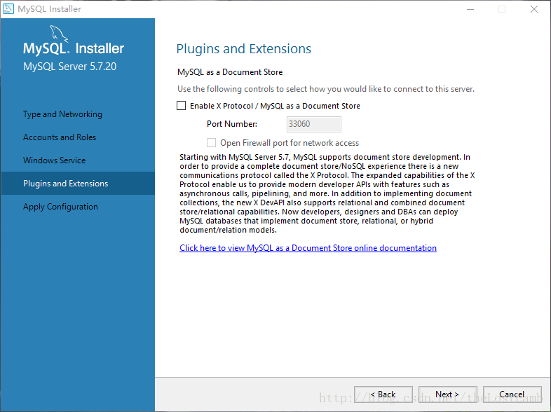

12.点击execute执行。
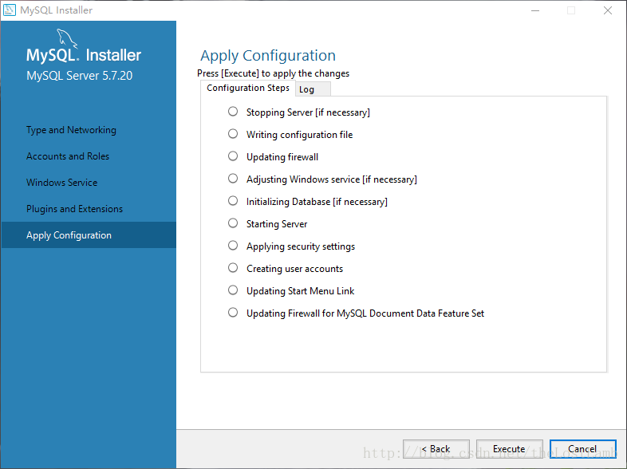

13.点击next。
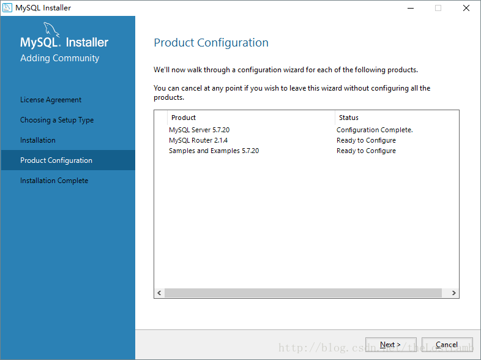

14.点击finish。
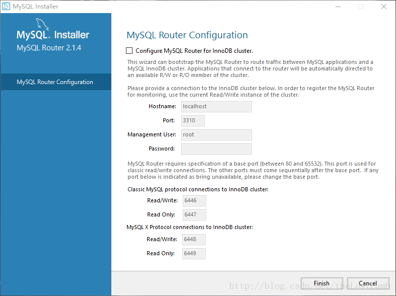

15.一路点击next，并check你的root密码，MySQL就成功在你的电脑上安装完成了。


16.安装完成后进入MySQL的安装目录，进入MySQL Sever，其目录下的文件如下： 
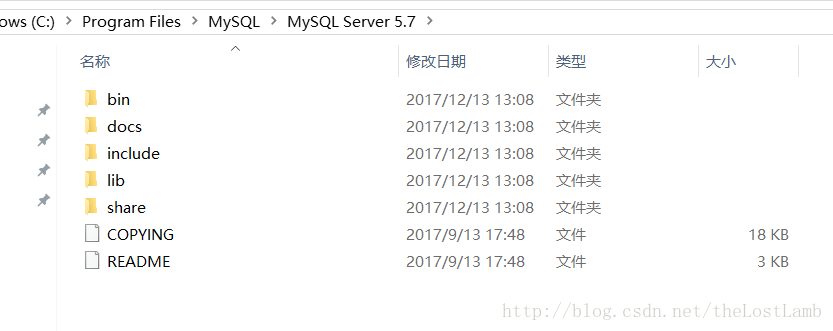

17.bin目录下保存了MySQL常用的命令工具以及管理工具、data目录是MySQL默认用来保存数据文件以及日志文件的地方（我的因刚安装还没有data文件夹）、docs目录下是MySQL的帮助文档、include目录和lib目录是MySQL所依赖的头文件以及库文件、share目录下保存目录文件以及日志文件。
进入bin目录，按住shift键然后点击鼠标右键可以选择在该目录下打开命令窗口，或者在地址栏中输入cmd进入命令窗口。输入mysql -u root -p后回车，然后会提示输入密码，输入密码后就会进入MySQL的操作管理界面。 
输入show databases；（注意末尾有分号）可以查看当前MySQL中的数据库列表，输入use test；可以进入test数据库（前提是要有此数据库），输入show tables可以查看test数据库中的所有表，输入quit可以退出MySQL的操作管理界面。 
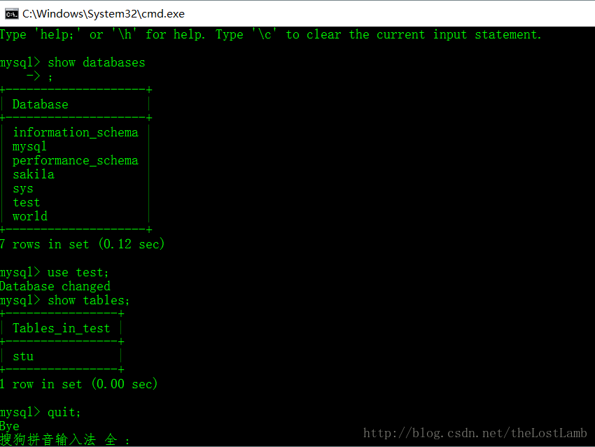


####三、登录MySQL
```s
登录本级：mysql -u root -p
登录远程mysql：mysql -h 127.0.0.1 -u root -p
```
####四、重置密码
```s
1.停止服务
2.管理员权限命令：mysqld -skip-grant-tables，不要关闭这个命令行，应该是一个等待的状态
3.新打开命令：mysql -u root -p，进入mysql
4.输入：use mysql;
5.输入：update user set password=password("password") where User = 'root';
6.关闭命令符，启动mysql服务器
```
####五、数据库数据的备份与恢复
```s
1.备份数据库的内容：
数据库名叫dddd
mysqldump -u root -p `dddd` > dddd.sql
回车后，输入密码
Enter password: ******
现在当前目录下，有个dddd.sql文件
导出到当前目录

数据库名叫做army
导出数据库：mysqldump -u root -p army > d:/database_dump.txt
D盘有一个database_dump.txt文件
这个是导出到不同级目录

2.恢复数据的话，需要先创建一个数据库例如创建的数据库叫SQL

* 恢复数据：mysql -u root -p SQL < dddd.sql
这是把当前目录下的文件夹dddd.sql文件的内容导入进SQL数据库内

* 恢复数据：mysql -u root -p armytest < d:/database_dump.txt
这是把不同目录下的文件database_dump.txt里面的内容导入到SQL数据库里

3.
数据库：db_name 
数据表：table_name 
用户名：root 
密码：dbpasswd

* 导出数据库表结构：
mysqldump -uroot -pdbpasswd -d db_name >db.sql;


* 导出数据库中某个表的表结构：
mysqldump -uroot -pdbpasswd -d db_name table_name >db.sql;

* 导出数据库的表结构和表数据：
mysqldump -uroot -pdbpasswd db_name >db.sql;

* 导出数据库中某个表的表结构和表数据：
mysqldump -uroot -pdbpasswd db_name table_name >db.sql;

【mysqldump -u root -p】是导出数据固定的代码
【mysql -u root -p】是导入数据固定的代码
```
