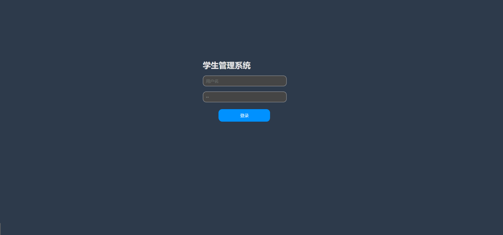
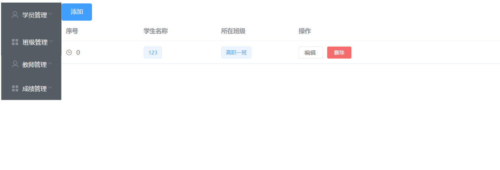
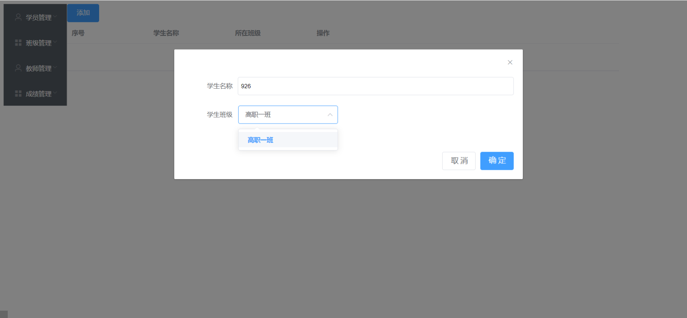
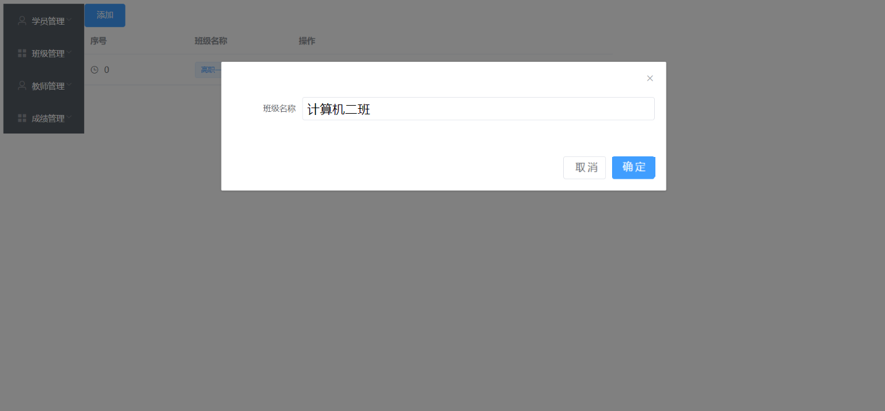
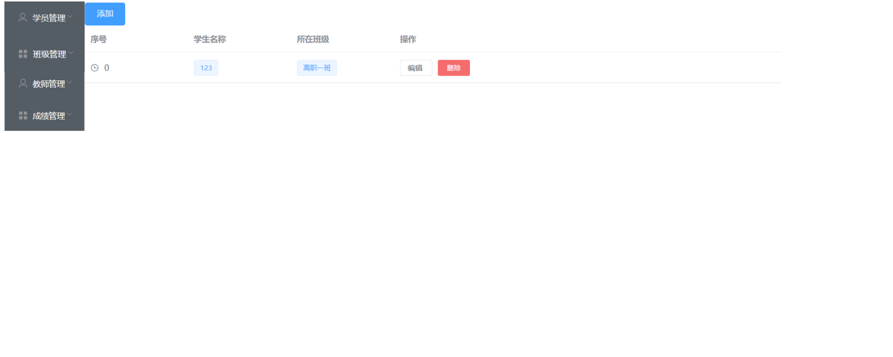
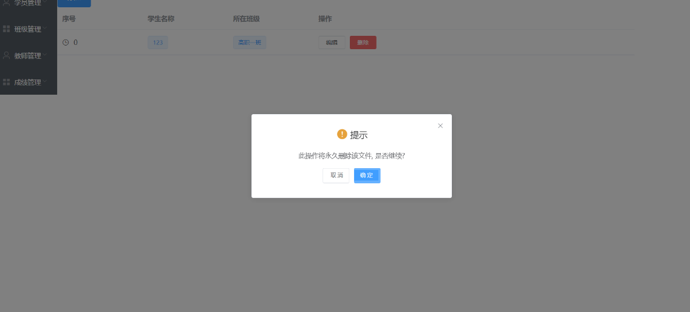
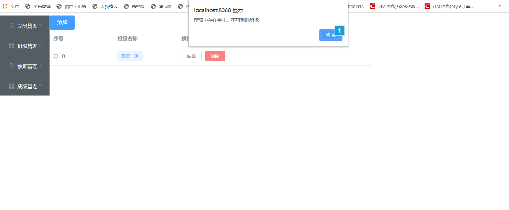

# 第03节：项目开发流程

### 一、需求分析
需求分析是指理解用户需求，就软件功能与客户达成一致，估计软件风险和评估项目代价，最终形成开发计划的一个复杂过程在这个过程中，用户的确是处在主导地位，需求分析工程师和项目经理要负责整理用户需求，为之后的软件设计打下基础。需求分析阶段包括：

1. 业务需求——反映了组织机构或客户对系统、产品高层次的目标要求，通常在项目定义与范围文档中予以说明。

2. 用户需求——描述了用户使用产品必须要完成的任务，这在使用实例或方案脚本中予以说明。

3. 功能需求——定义了开发人员必须实现的软件功能，使用户利用系统能够完成他们的任务，从而满足了业务需求。

4. 非功能性的需求——描述了系统展现给用户的行为和执行的操作等，它包括产品必须遵从的标准、规范和约束，操作界面的具体细节和构造上的限制。

5. 需求分析报告——报告所说明的功能需求充分描述了软件系统所应具有的外部行为。“需求分析报告”在开发、测试、质量保证、项目管理以及相关项目功能中起着重要作用。

### 二、明确技术选型。

* 前端页面：用Vue来写，网页的尺寸用px，
* 后台编程：用Egg来写后台，Cortonter与service来实现功能，
* 数据库：用的Mysql，建了一个库，然后库里建了User,Clazz,Student表等,　　
* 另外用到的技术：
    1. Ajax(前后台数据交互,局部刷新)，
    2. Squlize(Egg链接Mysql从而实现数据传输)),
    3. Element-ui(增加页面效果),
    4. Md5(密码加密),

### 三、简单构成

#### 学生信息管理
* 教务人员通过学生信息管理模块来管理学生信息，如进行学生信息的添加、修改、删除等。在进行信息的添加时，首先在新的窗口进行学生信息的录入，在保存的时候要进行学生学号是否有重复的检查，如果添加的学生编号有重复就要对用户进行提示。只有在不重复的情况下才能进行信息的添加。在进行信息的删除时，要首先打开提示窗口让用户确认是否要删除，只有在用户确认的情况下才能进行信息的删除。在进行信息的修改时，要根据用户选定的学生进行修改，即列出用户选定的学生的所有信息，在这个基础上进行学生信息的修改。

#### 班级信息管理
* 教务工作人员通过此模块来管理班级的信息，包括班级信息的添加，修改，删除等。在进行信息的添加时，打开新的窗口进行班级信息的录入，在保存的时候要进行班级的编号是否重复的检查，如果添加的班级编号重复要对用户进行提示，只有在信息不重复的前提下才能进行信息的添加，在进行信息的删除时，要首先弹出提示窗口让用户确认是否删除，只有用户确认后才能进行信息的删除。在进行信息的修改时，要能根据用户选定的班级进行修改，即列出用户选定的班级的所有信息，在这个基础上进行班级信息的修改。（如要塞中的班级管理）

#### 系统管理
* 该模块可以对系统登录的用户进行管理。在该模块中，教务人员可以添加允许登录的人员名单以及相应的密码，并对已有的用户进行密码修改或删除。

<!-- ### 二、任务分配
|序号|姓名|负责章节|职责|
|---|----|------------|----|
|1|张天庆|文字介绍|主管|
|2|丁凯|Git操作和管理|整理|
|3|苏震军|Git操作和管理|校对|
|4|莫鑫源|开发流程|编写|			
|5|高斌|开发流程|检查|
|6|王浩|前台|编写|
|7|郑浩然|后台|编写|
|9|何雨秋|前后台交互|检查|
|10|王博辉|数据库|编写| -->

### 四、UI设计

1. 登陆页面

2. 进入页面左侧栏有学生管理跟班级管理

3. 添加学生与班级页面

4. 添加功能

5. 添加成功

6. 删除页面

