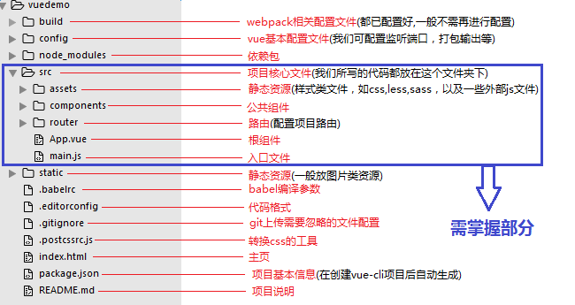

# 第04节：项目架构

### 一、项目分层

#### vue项目分层
* assets

放置静态资源(网页重构，第三方文件)

* router

路由

* ajax数据请求的封装
基于vue的项目，与后台请求数据我们通常使用的是axios，它是基于promise的http库，其提供的优秀的特性被广泛运用在项目当中，官方已推荐使用axios，放弃原有的vue-resource。

#### egg项目分层

* controller

controller顾名思义就是一个控制器，他的作用 负责解析用户的输入，处理后返回相应的结果，简单来说，对于HTML 页面请求中，Controller 根据用户访问不同的 URL，渲染不同的模板得到 HTML 返回给用户,所以它是负责业务调度的，所以在这一层应写一些业务的调度代码，而具体的业务处理应放在service中去写。
* middleware

middleware中间件位于客户机/ 服务器的操作系统之上，管理计算机资源和网络通讯。是连接两个独立应用程序或独立系统的软件。

* model

将你数据库某个表中的所有字段都放在一个地方，然后你使用的时候就非常方便了，不需要定义太多的变量。
* public

用来放置静态资源
* service

service是业务层，所以应该更切近于具体业务功能要求，所以在这一层，一个方法所体现的是一个可以对外提供的功能，比如增删改查。


### 二、项目目录结构

#### vue项目目录结构

vue.js是一套构建用户界面的渐进式框架。vue采用自底向上增量开发的设计。vue的核心库只关心视图层，非常容易学习，非常容易与其它库和已有项目整合。vue完全有能力驱动采用单文件组件和vue生态系统支持的库开发的复杂单页应用。

vue.js的目标是通过尽可能简单的API实现响应的数据绑定和组合的视图组件，vue项目结构如下，其中src文件夹是需要掌握的，所以本文也重点讲解其中的文件，至于其他相关文件，了解一下即可。

#### egg项目目录结构
```
├── app
| ├── router.js 用于配置 URL 路由规则
│ ├── controller 用于解析用户的输入，处理后返回相应的结果
│ | └── home.js
│ | └── user.js
│ ├── middleware (可选) 用于编写中间件
│ | └── checktoken.js
│ └── public 用于放置静态资源，可选
│ ├── service (可选) 用于编写业务逻辑层。
│ ├── view
│ ├── router.js
├── config 用于编写配置文件
| ├── plugin.js 用于配置需要加载的插件
| ├── config.default.js(默认环境)
├── logs
├── run
├── test
|── .autod.conf.js
|── .eslintignore
|── .eslintrc
|── .gitignore
├── .travis.yml
├── package-lock.json
├── package.json
├── README.md
├── README.zh-CN.md
————————————————
```
