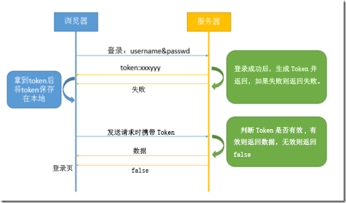

# JWT讲解

### 一、JWT简介

JWT（JSON WEB TOKEN）：JSON网络令牌，JWT是一个轻便的安全跨平台传输格式，定义了一个紧凑的自包含的方式在不同实体之间安全传输信息（JSON格式）。它是在Web环境下两个实体之间传输数据的一项标准。实际上传输的就是一个字符串。广义上讲JWT是一个标准的名称；狭义上JWT指的就是用来传递的那个token字符串。

简单来说：JWT是目前最流行的跨域身份验证解决方案，主要用于前后端分离项目的保持登录状态的方法。

### 二、Token概念

Token是服务器签发的一串加密字符串，是为了给客户端重复访问的一个令牌，作用是为了证明请求者（客户端）的身份，保持用户长期保持登录状态。

### 三、JWT的原理和工作方法

1. 浏览器向服务器端发送账号和密码
2. 服务器端验证账号与密码 如果成功，生成Token传给用户端，如果失败，则返回登录失败。
3. 浏览器利用localstorage存入token
4. 浏览器每次发送请求都带着token，服务器端判断当前的Token是否有效。判断有效则返回给浏览器数据，无效则返回false
5. 浏览器接收到false时，返回登录页。
   

<b>关于jwt的具体案例如下[index.html](https://github.com/xiaozhoulee/xiaozhou-examples/blob/master/03-jQuery/%E7%AC%AC10%E8%8A%82%EF%BC%9A%E8%BD%AE%E6%92%AD%E5%9B%BE/index.html)</b>